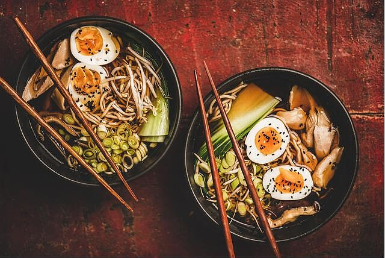

李探花 | 中华美食修炼记（一）

中国美食常用的烹饪方法（初）

#  拌

拌是一种常用的冷菜烹饪方法，操作时把生的原料或晾凉的熟料切成小型的丝、条、片、丁、块等形状，再加上各种调味料，拌匀即可。

原材料洗净，根据其属性切成丝、条、片、丁或块，放入盘中。原材料放入沸水中焯烫一下捞出，再放入凉开水中凉透，控净水，入盘。将蒜、葱等洗净，并添加盐、醋、香油等调味料，浇在盘内菜上，拌匀即成。

#  腌

腌是冷菜的一种烹饪方法。

是把原料在调味卤汁中浸渍，或用调味品加以涂抹，使原料中部分水分排出，调料渗入其中，腌的方法很多，常用的有盐腌、糟腌、醉腌。

#  卤

卤是把原料洗净后，放入调制好的卤汁中烧煮成熟，让卤汁渗入其中，晾凉后食用的一种冷菜的一种冷菜烹调方法。

# 冻

冻是一种利用动物原料的胶原蛋白经过蒸煮之后充分溶解，冷却后能结成冻的一种冷菜烹调方一种冷菜烹调方法。

#  炒

炒是最常用的一种热菜烹调方法，以油为主要导热体，将小型原料用中火或旺火在较短时间内加热成熟，所用底油多少随料而定，调味成菜的一种烹饪方法。将原材料洗净，切好备用。锅烧热，加底油，用葱、姜末炝锅。放入加工成丝、片、块状的原材料，直接用旺火翻炒至熟，调味装盘即可。依照材料、火候、油温高低的不同，可分为生炒、滑炒、熟炒及干炒等方法。

#  熘

熘法一般是先将原料经过油炸或开水氽（氽字念 tǔn ，氽的本义是漂浮。又引申为用油炸，因为油炸食品时大多食物都浮在油面上，如氽油条、氽虾片、油氽馒头、油氽花生米。）熟后，另起油锅调制卤汁（卤汁也有不经过油制而以汤汁调制而成的），然后将处理好的原料放入调好的卤汁中搅拌或将卤汁浇淋于处理好的原料表面。

溜菜需两步完成。第一步先将挂糊或上浆原料用中等油温炸过；第二步将芡汁调料等放入锅内，倒入炸好的原料，颠翻出锅。溜菜具有香脆、鲜嫩、滑软等特点。一般在第二步溜炒时宜用旺火，快速翻炒出锅。

如：焦溜肉片、醋溜白菜。

#  烧

烧是烹调中国菜肴的一种常用技法，先将主料进行一次或两次以上的油炸过或用火焯过之后，再加上辅料，兑入汤汁煨至熟烂的方法，大火烧开后小火烧至入味，再用大火收汁成菜的烹调方法。

原料洗净，切好备用。将原料放锅中加水烧开，加调味料，改用小火烧至入味或酥烂（肉类、海味）或软嫩（鱼类、豆腐）或鲜嫩（蔬菜）。用大火收汁，调味后，起锅装盘即可。

由于烧菜的口味、色泽和汤汁多寡的不同，它又分为红烧、白烧、干烧、酱烧、葱烧、辣烧等许多种。

特点是汁浓、汤少，菜质软烂，色泽美观。如“红烧海参”、“干烧鱼”。

#  焖

是把主料先过油后炸至半熟，再加汤用文火焖至熟烂的烹制法，特点是软烂不腻。

操作过程与烧很相似，但小火加热的时间更长，火力也跟小，一般在半小时以上。

如：黄焖鸡块、油焖大虾。

#  烤

烤是把食物原料放在烤炉中利用辐射热使之成熟的一种烹饪方法。

烤制的菜肴由于原料是在干燥的热空气烘烤下成熟的，所以表面水分蒸发，凝成一层脆皮，原料内部水分不能继续蒸发，因此成菜形状整齐，色泽光滑，外脆里嫩，别有风味。

#  炸

将主料挂糊或不挂糊下热油锅，由生炸熟的方法，外焦里嫩。

炸有很多种，如清炸、干炸、软炸、酥炸、面包渣炸、纸包炸、脆炸、油浸、油淋等。

如“干炸里脊”、“软炸虾仁”等

#  炖

炖和烧相似，所不同的是，炖制菜的汤汁比烧菜的多。

炖先用葱、姜炝锅，再冲入汤或水，烧开后下主料，先大火烧开，再小火慢炖。炖菜的主料要求软烂，一般是咸鲜味。

先将主料切块煸炒，再兑入汤汁，用文火慢煮的方法。特点是有汤有菜，菜软烂，汤清香。

如：清炖鸡。

#  煲

煲汤需要的烹调时间很长，没有耐心是很难煲出好汤的。煲汤有一秘诀，那就是“三煲四炖”。直白地讲，就是煲一般需要三个小时左右，炖则需要四个小时左右。餐桌上有碗热气腾腾的鲜汤，常使人垂涎欲滴，特别是在冬春季，汤既能助人取暖，又能使人的胃口大开。

煲汤往往选择富含蛋白质的动物原料，最好用牛、羊、猪骨和鸡、鸭骨等。其做法是：先把原料洗净，入锅后一次加足冷水，用旺火煮沸，再改用小火，持续20分钟，撇沫，加姜和料酒等调料，待水再沸后用中火保持沸腾3～4小时，使原料里的蛋白质更多地溶解， 浓汤呈乳白色，冷却后能凝固可视为汤熬到家了。

炖应该注意以下五忌：

一是忌中途添加冷水，因为正加热的肉类遇冷收缩，蛋白质不易溶解，汤便失去了原有的鲜香味。

二是忌早放盐，因为早放盐能使肉中的蛋白质凝固，不易溶解，从而使汤色发暗，浓度不够，外观不美。

三是忌过多地放入葱、姜、料酒等调料，以免影响汤汁本身的原汁原味。

四忌过早过多地放入酱油，以免汤味变酸，颜色变暗发黑。

五忌让汤汁大滚大沸，以免肉中的蛋白质分子运动激烈使汤浑浊。

#  烩

烩是将汤和菜混合起来的一种烹调方法。是将原料油炸或煮熟后改刀，放入锅内加辅料、调料、高汤烩制的方法。用葱、姜炝锅或直接以汤烩制，调好味再用水淀粉勾芡。有香嫩、鲜的特点。烩制方法简单，要注意火候，一般用中火使汤收浓。烩菜的汤与主料相等或略多于主料。

常见有“烩三鲜”、“烩鸡丝”。

# 炝

炝是把切配好的生料，经过水烫或油滑，加上盐、味精、花椒油拌和的一种冷菜烹调方法。

#  爆

是旺火热油，原料下锅后快速操作。要求刀工处理粗细一致，烹前备好调味品，动作要麻利迅速。

爆法主要用于烹制脆性、韧性原料，如肚子、鸡肫、鸭肫、鸡鸭肉、瘦猪肉、牛羊肉等。如“葱爆羊肉”、“酱爆鸡丁”等。

常用的爆法主要为：油爆、芜爆、葱爆、酱爆等。

#  烹

烹分为两种：以鸡、鸭、鱼、虾、肉类为料的烹；以蔬菜为主的烹。

以肉为主的烹，一般是把挂糊的或不挂糊的片、丝、块、段用旺火油先炸一遍，锅中留少许底油置于旺火上，将炸好的主料放入，然后加入单一的调味品（不用淀粉），或加入多种调味品对成的芡汁（用淀粉），快速翻炒即成。

以蔬菜为主料的烹，可把主料直接用来烹炒，也可把主料用开水烫后再烹炒。

#  煎

煎是先把锅烧热，用少量的油刷一下锅底，然后把加工成型（一般为扁型）的原料放入锅中，用少量的油箭制成熟的一种烹饪方法。

一般是先煎一面，再煎另一面，煎时要不停地晃动锅子，使原料受热均匀，色泽一致。

#  贴

贴是把几种粘合在一起的原料挂糊之后，下锅只贴一面，使其一面黄脆，而另一面鲜嫩的烹饪方法。它与煎的区别在于，贴只煎主料的一面，而煎是两面。

#  氽

汆是用生料加工调味后，放开水锅中煮熟的方法。氽菜简单易做，重在调味。一般用鸡汤、骨肉汤，同时加入配料增味。特点是清淡、爽口。有菜有汤，适宜冬季适用。

如：汆丸子。

#  煮

煮和氽相似，但煮比氽的时间长。

煮是把主料放于多量的汤汁或清水中，先用大火烧开，再用中火或小火慢慢煮熟的一种烹调方法。

#  蒸

蒸是一种重要的烹调方法，其原理是将原料放在容器中，以蒸汽加热，使调好味的原料成熟或酥烂入味。其特点是保留了菜肴的原形、原汁、原味。

原材料洗净，切好备用。将原材料用调味料调好味，摆于盘中。将其放入蒸锅，用旺火蒸熟后取出即可。

常见的蒸法有干蒸、清蒸、粉蒸等几种。如：清蒸鸡块、粉蒸肉。

# 熏

熏是将已经处理熟的的主料，用烟加以熏制的一种烹调方法。

# 卷

卷是以菜叶、蛋皮、面皮、花瓣等作为卷皮，卷入各种馅料后，裹成圆筒或椭圆形后，再蒸或炸的一种烹调方法。

# 酥

先将原料下锅煮熟或蒸熟再用油炸至香酥的方法，特点是外焦脆，里嫩软、鲜香可口。如“香酥鸡”、“香酥肉”。

# 扒

扒是锅底加油烧熟，炒锅加汤，放入主料及调料，用文火扒烂，勾芡收汁的烹制法。鲜软，汁浓，易消化。常见的有“扒三鲜”等。

# 砂锅

将原料加工后，装入砂锅中，调入作料、配料，用文火慢慢煨炖至熟烂，营养丰富。如“砂锅豆腐”、“砂锅鸡”。 

# 拔丝

拔丝是将糖（冰糖或白糖）加油或水熬到一定的火候，然后放入炸过的食物翻炒，吃时能拔出糖丝的一种烹调方法。

如：红糖糍粑、拔丝菜果、拔丝山药等。

# 蜜汁

蜜汁是一种把糖和蜂蜜加适量的水熬制而成的浓汁，浇在蒸熟或煮熟的主料上的一种烹调方法