# 1 酱爆鸡丁

食材预处理：

- 鸡胸肉：切成丁，加一勺盐、料酒、胡椒粉、半个蛋清、老抽、淀粉，搅拌均匀腌制十五分钟。

- 姜酒水：姜切成片，加入料酒浸泡融合。

制作：

- 油温五成热，下入鸡丁，定型后不停搅动使其均匀受热，炸熟后捞出备用。

- 起锅烧油，再放入少许香油，加入黄豆酱，倒入姜酒水。小火不停搅拌，炒散后再倒入姜酒水，这个步骤重复几次后，加入盐、白糖、鸡精，继续搅拌至枣红色。
- 将炸好的鸡丁倒入制作好的料汁中，让料汁充分裹满鸡丁。然后加入核桃仁，加入少许香油。

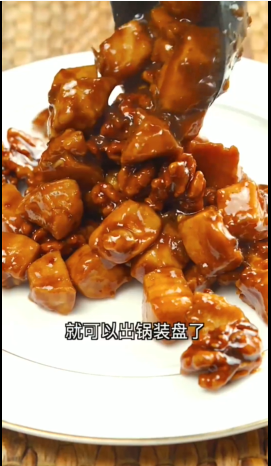

# 2 果子汤（天津早点）

- 果子也就是我们现在常说的油条切成3-5厘米的小段。切少量葱花备用；
- 准备好三个鸡蛋，将鸡蛋打入碗中，并用筷子搅拌，直至鸡蛋打散；
- 将切好的葱花炝锅，加入虾皮炒制，再加果子，炒香后加水烧开，淋入打散的鸡蛋，加盐、生抽、香油调味，出锅前放少量香菜、葱花。

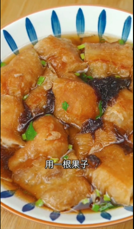

果子为什么有油条的意思？

“果”字还有一个即将消失的意思，**果通“馃”，馃子是旧式点心的统称。最初指生果、干果、凉果、蜜饯、饼食等食物**（这个字有时候还会被写成“粿”或“菓”，实则都来源于“果”）。

# 3 溜锅地三鲜

原料：

- 土豆、茄子、青椒、葱姜蒜
  老抽、酱油、料酒、米醋、糖、盐、淀粉、

食材预处理：

- 土豆
  土豆先平均切成四部分，然后将这四部分打斜切成两半，切成大三角。
  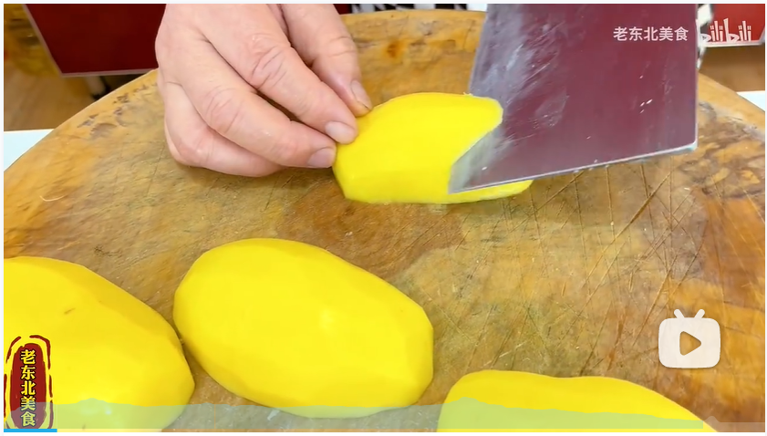
  然后切成薄片，厚度为半厘米厚即可。

- 茄子
  切成滚刀块，六公分长、四公分厚即可。
  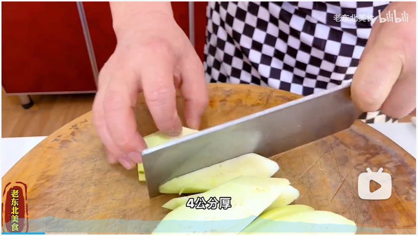

- 青椒
  第一种方法，切成滚刀块，
  第二种方法，切成大排骨条，然后切成五到六公分长的条状。
  目的是整齐，看起来好看

制作：

1. 土豆片下油锅，温度不宜过高，浸炸，过程中防止几片粘连在一起。  捞起来，然后温度调成六成热，再下锅，过五六秒捞出。
2. 茄子下油锅，油温再提一提，油温过低茄子容易吸油，油温过高颜色不好看。  捞起来，然后调温至六成热，放入锅中炸，杏黄色的时候就可以捞出。
   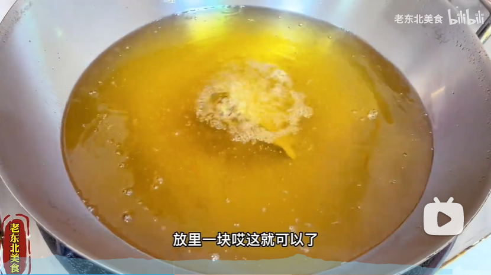
   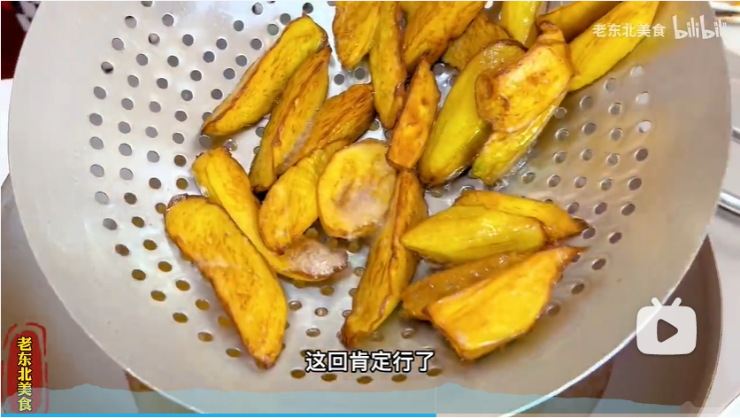
3. 青椒和茄子放一起，然后热油倒入冲烫一下就可以了。
   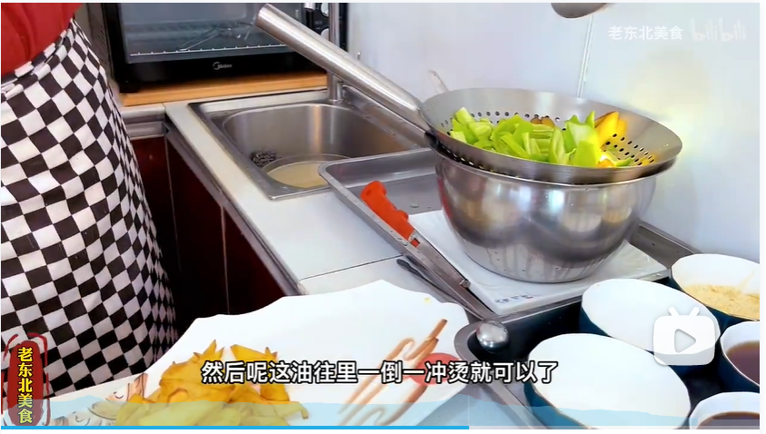
4. 葱姜蒜下锅，留点蒜（包尾蒜）。  放入料酒（花椒水），放入二合一酱油，少来一点老抽，加上四两汤，加入八分口盐，加入少量糖，加入一点味精。
   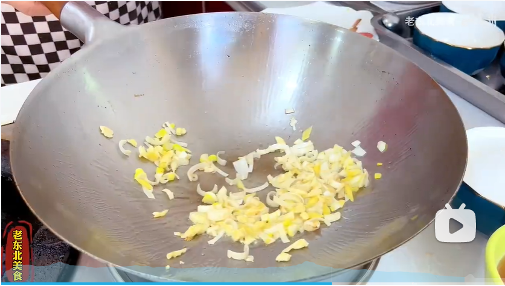
5. 土豆下锅，放入茄子和青椒。  为了防止青椒变色，边翻勺边加入淀粉水。  让主料上边形成琉璃状，像长了一层玻璃一样才好看。
   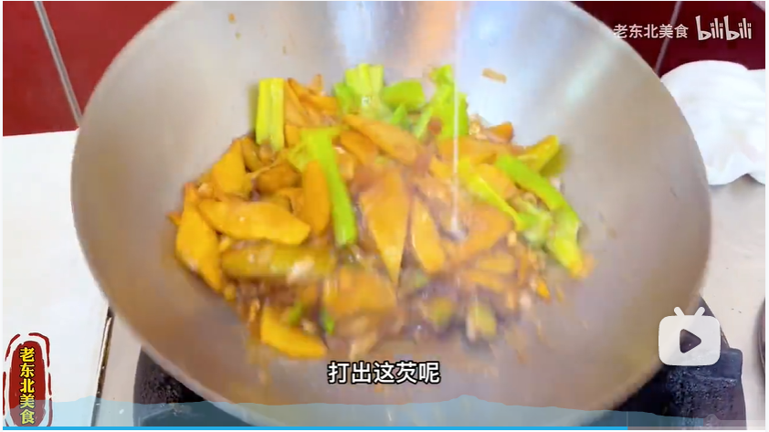
   然后放入蒜，加入米醋，往锅边一打，加入点材料油。

注意：

- 青椒的颜色要保持翠绿
  茄子要酥烂
  土豆要面

# 4 干炸蘑菇

制作：

1. 椒盐
   花椒用清水洗一下，然后进行煸炒，加入盐。
   盐炒至变色，花椒粒变成咖啡色。
   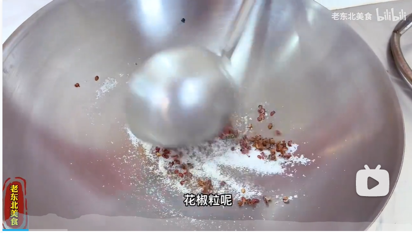
   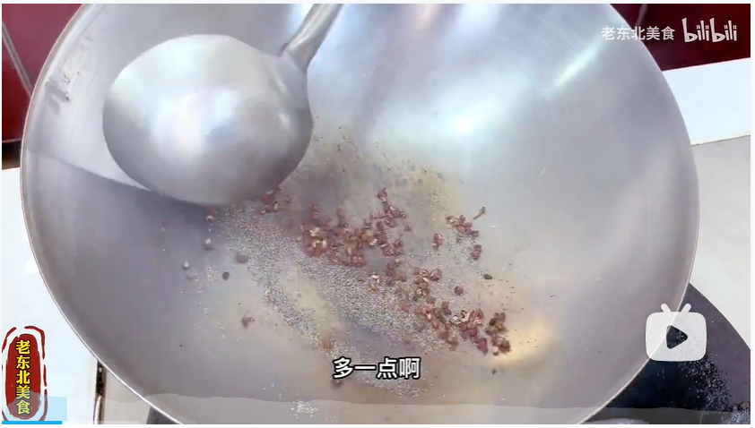
   大概需要五分钟多一点。  然后放入蒜缸里，然后加入点味精，研磨。
   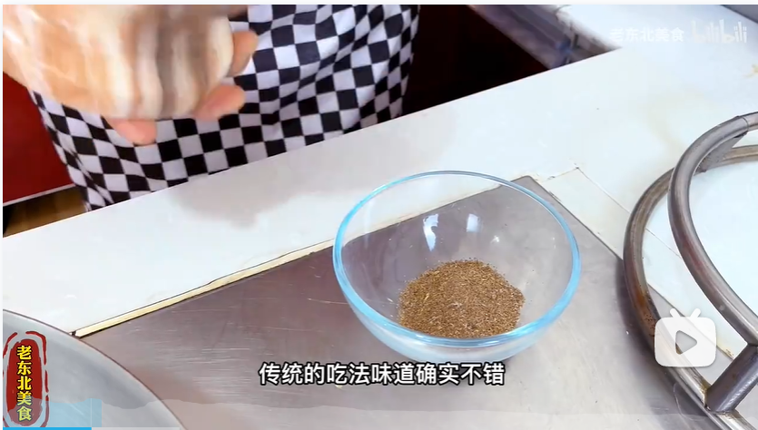

2. 葱姜水
   葱姜，加入盐，搅拌均匀，用手攥几下。
   加上点黄酒，让盐化透。
   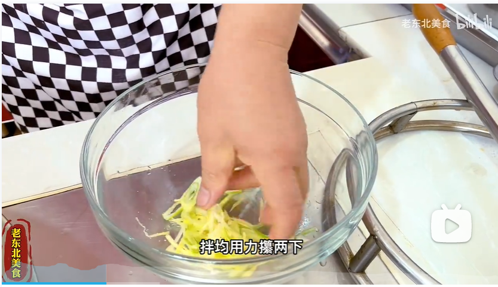

3. 蘑菇
   在清水里煮，撇沫，捞出。
   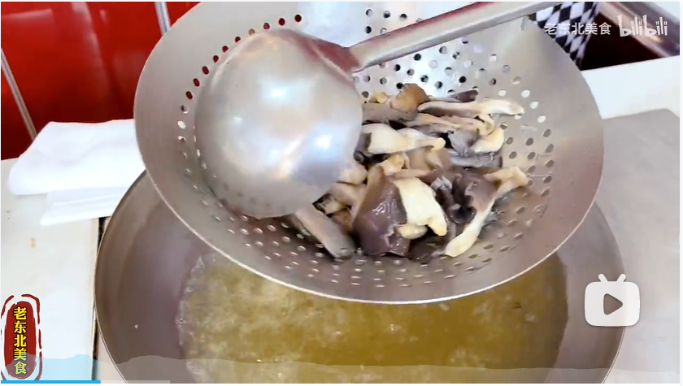
   然后用凉水过滤降温，用手攥一下，去除多余水分。
   将葱姜水倒入蘑菇中，再加入点盐，搅拌均匀，腌制两三分钟。

4. 调糊
   蛋清一个，加入一点油，加入淀粉、面粉，再加入水
   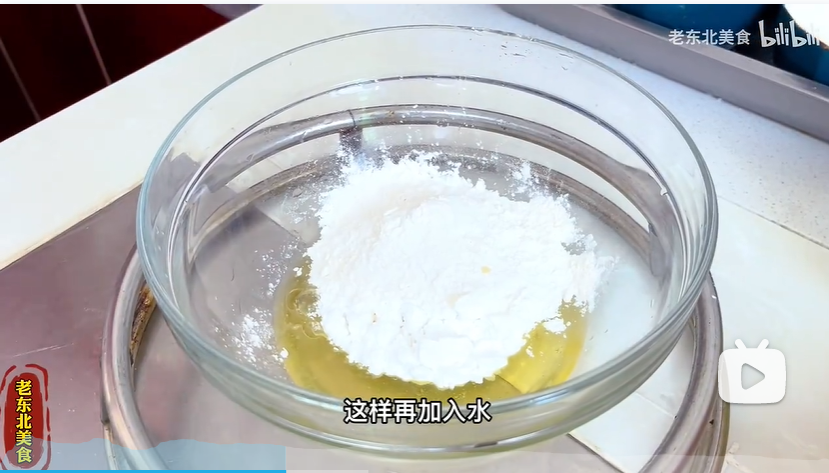
   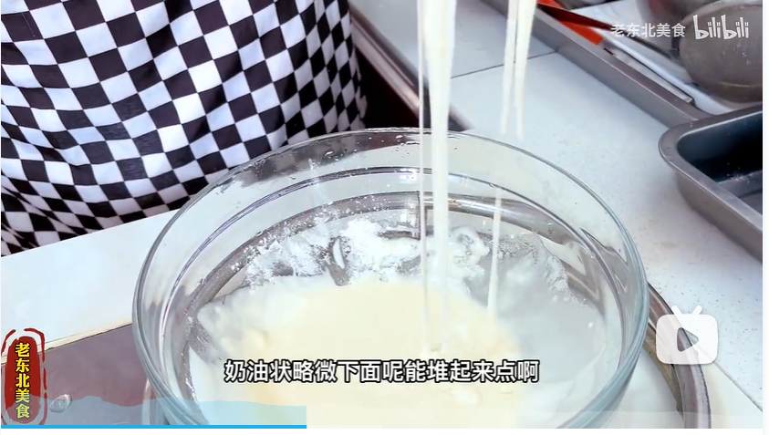
   调至奶油状，滴落时能堆出点纹路。
   注意：三分之一是淀粉，少于三分之一的面粉。

5. 加入少量土豆粉拌蘑菇，然后将蘑菇放入糊中，拌均匀。
   下油锅炸，一拿五六块往里散，下锅后能浮起来便是油温够了。
   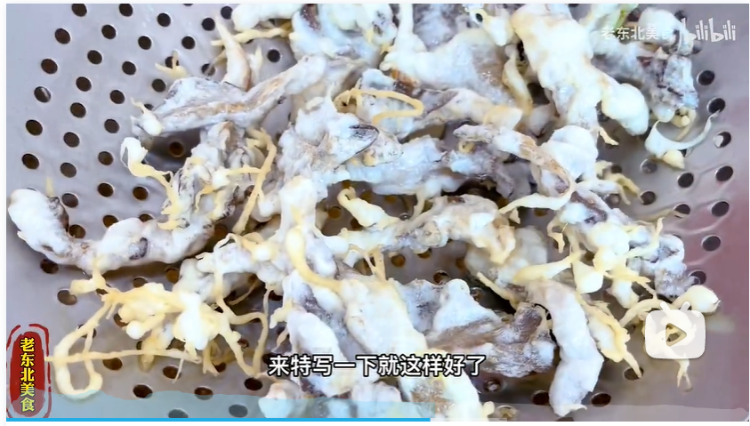
   漏勺一颠能分得开就行。

6. 再将蘑菇放入温度更高点的油锅中，呈现出杏黄色就可以了。
   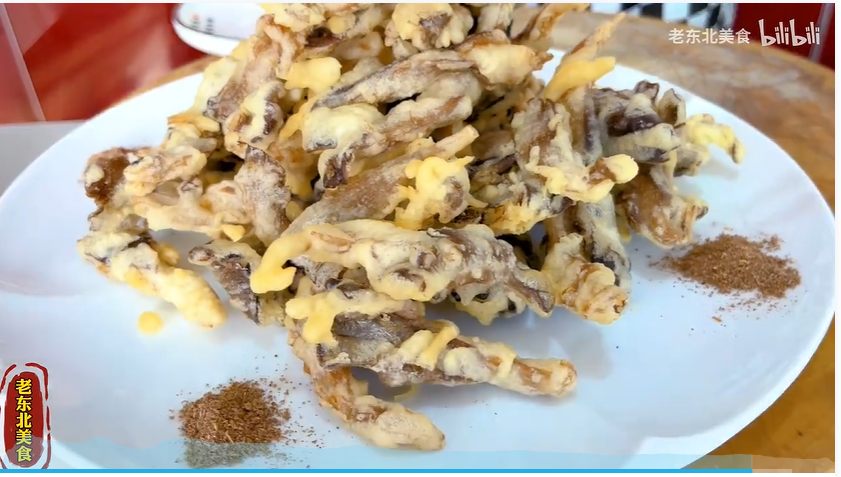

注意：

- 蘑菇局部酥脆就可以了。
