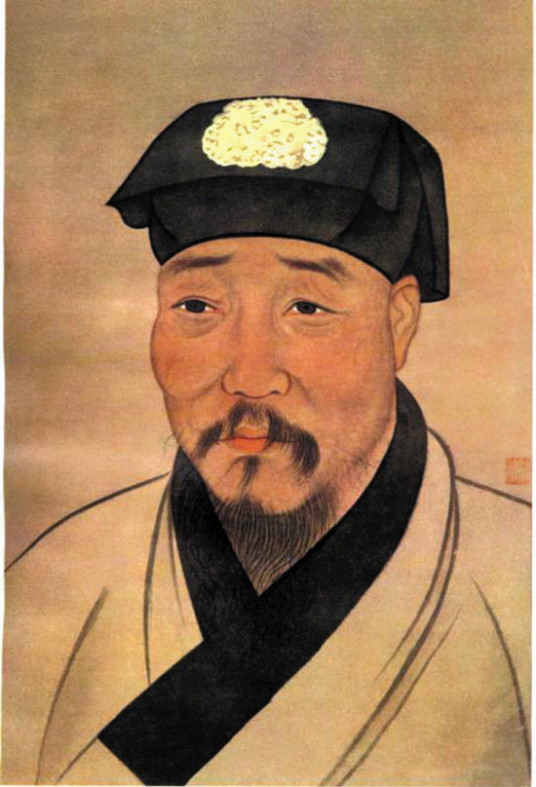

# 徐渭其人（一）

**一生坎坷，二兄早亡，三次婚姻，四处帮闲，五车学富，六亲皆散，七年牢狱，八试不中，九番自杀，十堪嗟叹！**

徐渭于明武宗正德十六年二月初四日（1521年3月12日）出生于绍兴府山阴县观桥大乘庵东（今属浙江绍兴）一个趋向衰落的大家族。其父徐鏓（qiāng）曾任四川夔州府（治今重庆市）同知。徐鏓的原配童氏，生下徐淮、徐潞两个儿子；继娶苗氏，不曾生育。徐鏓晚年纳妾才生下徐渭，徐渭自幼由嫡母苗夫人抚养。在徐渭出生百日后，徐鏓便去世。十岁时，徐渭的生母又被苗氏逐出家门，骨肉分离，对他而言刺激颇深。徐渭十四岁时，苗夫人去世，徐渭随长兄徐淮生活。二人年龄相差三十多岁，又缺乏手足之情，相处得不甚愉快。

## 徐渭生平

生为庶子，百日丧父。

六岁读书，九岁能文。

十岁时（1530年），生母被嫡母逐出家门，十四岁嫡母亡故。徐渭在嫡母病危期间三天三夜没有吃饭。少年时得不到亲生父母的疼爱，家中地位低下，有寄人篱下之感，受到兄长和身边人的歧视，徐渭选择结婚一途逃脱家，。十多岁时仿西汉辞赋家扬雄《解嘲》写就《释毁》，享誉远近，当地的绅士们称他为神童。一冷一热，在世态炎凉之中，徐渭形成了既孤傲自赏，又郁郁寡欢的性格。

二十岁时（1540年），考中了秀才。但是直到四十一岁，他仍是个秀才。

二十一岁时（1541年），入赘绍兴富户潘氏，并随任典史的岳父潘克敬游阳江今属（广东），协助办理公文，对官场情况开始有所了解。不久，他又返回山阴，参加乡试，往返浙粤两地。潘氏和岳父爱才，对他不错，夫妻相敬如宾。三年后生了一个男孩，叫做徐枚，而患有肺病的潘氏因生孩子病情加重，第二年就去世。

二十四岁时（1544年），得子，取名为徐枚。

二十五岁时（1545年），徐家财产又被豪绅无赖霸占，两个兄长因为得病和吃丹药中毒而死，所属的房产田园不复。胡氏认为不公提出诉讼，徐渭为应诉浪费了很多精力。

二十六岁时（1546年），妻子潘氏得病早逝。转眼阴阳两隔，心痛的徐渭十年内再未娶妻。人亡家破，功名不第，使徐渭不知所措。为了谋生，他离乡背井来到太仓（今属江苏），却不得要领，只能徒劳而返。

二十八岁时（1548年），徐渭开设“一枝堂”，招收学童，教私塾以糊口，并且开始追随季本、王畿等人，研习王守仁的学说。

二十九岁时（1549年），徐渭不顾世俗偏见，把母亲接回自己家中。徐渭从杭州买回妾胡氏。日子和谐幸福，徐渭专为此作了首诗《纳妾诗》：“角枕覆衾长，新香异旧香。昔年曾射雉，此日复求凰。杏靥开春镜，鸦云换晚妆。夫君莫早起，初日未高梁”。 胡氏长的还比较漂亮，也很关心徐渭。所以 ，他就有“新香异旧香”之感。可是，好景不长。没多久，矛盾就显露出来了，主要是婆媳矛盾。徐渭认为对于胡氏可以用“劣”字来形容却没有细讲事例。艰辛的生活更易激化家庭矛盾，最后徐渭没办法便将胡氏卖掉。

三十岁时（1550年），蒙古首领俺答率军在北京一带掳掠，史称“庚戌之变”。徐渭听闻此讯后，义愤填膺，挥笔创作《今日歌》《二马诗》等，痛斥权臣严嵩误国。

三十二岁（1552年），徐渭考中乡试的初试，并受到浙江提学副使薛应旂的赏识，拔为第一，增补为县学廪膳生。但在复试时，徐渭仍未中举。

三十四岁（1554年），倭寇进犯浙闽沿海，绍兴府成为烽火之地。平时好阅兵法的徐渭，先后参加了柯亭、皋埠、龛山等地的战役，并出谋划策，初步显示了军事才能。

三十六岁（1556年），潘氏逝世十周年，徐渭含泪写下一首诗：黄金小纽茜衫温，袖折犹存举案痕。开匣不知双泪下，满庭积雪一灯昏。

三十八岁（1558年），胡宗宪钦慕徐渭的才识。经过多次相邀，胡宗宪终于将徐渭招入幕府，充当幕僚。被胡招为幕僚、为胡抗击倭寇出谋划策的四年，是徐渭生命中罕见的高光时刻。

三十九岁（1559年），徐渭第二次倒插门，入赘王家。 徐渭说这一任妻子“劣甚”，十足悍妇。三个月后，徐渭要求离婚，双方协议离婚。徐渭在《畸谱》中有简要提及：“夏，入赘杭之王，劣甚。始被诒而误，秋，绝之，至今恨不已。”让人感觉倒好像徐渭刚刚经历了一场骗局一样。

四十岁（1560年），胡宗宪为了让徐渭能长期为他效力，在杭州为他聘定张氏为继室。徐渭对此感激不尽，写下《谢督府胡公启》。徐渭言：“渭失欢帷幕，动逾十年，俯托丝萝，历辞三姓。过持己见，遂骇众闻，诋之者谓矫激而近名，高之者疑隐忍以有待。明公宠以书记，念及室家，为之遣币而通媒，遂使得妇而养母。”徐渭阐明过去婚姻不成功的缘由主要在于“过持己见”，也就是说自己太固执且要求条件偏高。胡宗宪不仅为徐渭聘张氏，而且聘金也是由他代给的，徐渭坐享其成。此次婚后第二年十一月就有了第二个儿子徐枳。

四十一岁（1561年），徐渭第八次乡试未中，不久幕府解散。

四十二岁（1562年），在徐阶的策动下，胡宗宪受到参劾，并于次年被逮捕至京（后因平倭有功，只受到免职处分），徐渭便离开了总督府。

四十三岁（1563年），徐渭应礼部尚书李春芳之聘，前往京师。次年，因与李春芳性格不合，便辞归故里。不料，李春芳不能容忍徐渭的辞聘，威胁徐渭归复到他的门下。徐渭只得赶回北京，请旧友说情，才算了结此事。

四十五岁（1565年），胡宗宪再次被逮入狱，并死于狱中，他原先的幕僚也有数人受到牵连。徐渭生性本就有些偏激，因连年应试未中，加上精神上很不愉快，此时他对胡宗宪被构陷而死深感痛心，也担忧自己受到迫害，于是对人生彻底失望，以至发狂。他写了一篇文辞愤激的《自为墓志铭》，而后拔下壁柱上的铁钉击入耳窍，流血如迸，医治数月才痊愈。后又用椎击肾囊，也未死。如此反复发作，反复自杀有九次之多。

四十六岁（1566年），徐渭在又一次狂病发作中，因怀疑继妻张氏不贞，将其杀死。按明律杀人应当偿命。由于明律又规定，癫狂病人犯病期间杀人可轻判，加上有同窗在京城的打点关照，只入狱七年。在狱中一直研习诗文书画，竟有所成。出狱后一直过着清贫生活，曾编修县志，游过边塞，再没娶过妻室。

四十八岁（1568年），生母病故时短期出狱，办理丧事。

五十三岁（1573年），在朋友的解救下，徐渭借明神宗朱翊钧即位大赦之机获释。

七十三岁（1593年），徐渭在穷困潦倒中去世，终年七十三岁。葬于绍兴城南木栅山。徐渭身边只有一条大黄狗作伴，床上连一张席子都没有。他死前创作《畸谱》，自称“畸人”。漫长悲苦的一生，慰藉徐渭的只有酒。“取酒聊以自慰，兼以驱愁悲”，在醉酒中他可以暂时忘却现实，求得心灵的安静。

